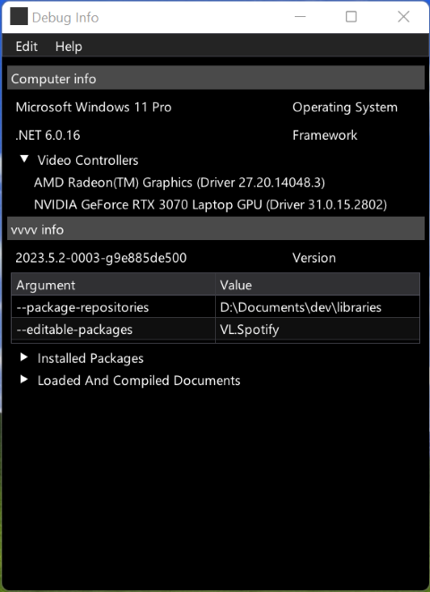

# VL.DebugInfo.HDE

 A vvvv gamma editor extension that displays relevant debug information and allows to share them easily.

<p align="center">

</p>

## Installation

Go to vvvv gamma's command line and type

```
nuget install VL.DebugInfo.HDE -pre
```

For more information on how to install nugets, have a look at [this section](https://thegraybook.vvvv.org/reference/hde/managing-nugets.html#installing-the-latest-version-of-a-nuget) from the Gray Book.

## Usage

- Once installed, press <kbd>ALT</kbd> + <kbd>D</kbd> to open the _Debug Info_ window. 
- Press <kbd>CTRL</kbd> + <kbd>C</kbd> to copy all information as Markdown
- Press <kbd>CTRL</kbd> + <kbd>SHIFT</kbd> + <kbd>C</kbd> to format them for a [forum](https://discourse.vvvv.org/) post.

## Credits

- [Hardware.Info](https://github.com/Jinjinov/Hardware.Info) by Jinjinov
- [Grynwald.MarkdownGenerator](https://github.com/ap0llo/markdown-generator) by ap0llo
